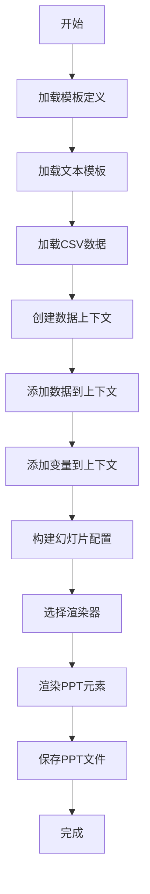

# PPT智能生成系统

## 📋 项目概述

这是一个基于模板的PPT智能生成系统，专为房地产数据分析设计。系统支持通过配置化的模板和动态数据来生成专业的PPT幻灯片。

### 🎯 核心特性

- **模板驱动**: 通过YAML配置定义PPT模板，支持灵活的版式选择
- **动态文本**: 使用Jinja2模板引擎支持变量替换和文案变体
- **多版式支持**: 支持5种标准版式（单栏/双栏图表、表格等）
- **数据分离**: 支持CSV等外部数据源，实现数据与逻辑分离
- **可扩展架构**: 清晰的四层架构设计，易于扩展和维护

## 🏗️ 系统架构

### 四层架构设计

```
┌─────────────────────────────────────────────────────────────┐
│                    展示层 (Presentation)                    │
│                  test_new_system.py, 快速生成脚本             │
├─────────────────────────────────────────────────────────────┤
│                    业务逻辑层 (Business)                      │
│                     ppt_engine.py                          │
├─────────────────────────────────────────────────────────────┤
│                    服务层 (Service)                         │
│          template_system/ + data_manager/ + rendering/    │
├─────────────────────────────────────────────────────────────┤
│                    基础设施层 (Infrastructure)                │
│                  core/ + 第三方库                           │
└─────────────────────────────────────────────────────────────┘
```

### 核心模块说明

| 模块 | 职责 | 关键文件 |
|------|------|----------|
| **core/** | PPT基础操作 | `ppt_operations.py`, `ppt_schemas.py` |
| **template_system/** | 模板系统 | `catalog.py`, `builder.py`, `text_manager.py` |
| **data_manager/** | 数据管理 | `context.py` |
| **rendering/** | 渲染系统 | `slide_renderers.py` |
| **ppt_engine.py** | 生成引擎 | 统一的PPT生成接口 |

## 🚀 快速开始

### 环境要求

- Python 3.8+
- 依赖包见 `pyproject.toml`

### 安装依赖

```bash
uv sync
```

### 快速测试

```bash
# 运行基本测试
uv run python test_new_system.py

# 检查生成的PPT文件
ls output/
```

## 📁 项目结构

```
PPTReviewer/
├── core/                          # PPT基础操作层
│   ├── ppt_operations.py          # PPT文件操作
│   └── ppt_schemas.py             # 数据模型定义
├── template_system/               # 模板系统
│   ├── catalog.py                 # 模板目录和加载
│   ├── builder.py                 # 幻灯片配置构建器
│   └── text_manager.py            # 文本模板管理
├── data_manager/                  # 数据管理层
│   └── context.py                 # 数据上下文管理
├── rendering/                     # 渲染层
│   └── slide_renderers.py        # 幻灯片渲染器
├── resources/templates/            # 模板配置文件
│   └── template_definitions.yaml  # 模板定义
├── template_system/text_pattern.yaml # 文本模板
├── output/                        # 生成的PPT文件
├── BeijingLiangxiang_slide1_chart1.csv # 示例数据文件
├── test_new_system.py             # 测试脚本
└── ppt_engine.py                  # 统一生成引擎
```

## 🔧 配置系统详解

### 1. 模板定义 (`resources/templates/template_definitions.yaml`)

定义每个PPT模板的基本信息：

```yaml
- uid: "T01_Supply_Trans_Bar"
  # 关联文案 (指向 text_patterns.yaml)
  theme_key: "Block Area Segment Distribution"
  function_key: "Supply-Transaction Unit Statistic"
  # 核心解耦：在这里选择版式！
  layout_type: "single_column_bar"
  summary_item: 1
  # 数据映射
  data_keys:
    chart_main: "supply_trans_data"
```

**字段说明**：
- `uid`: 模板唯一标识符
- `theme_key`: 主题名称，对应`text_pattern.yaml`
- `function_key`: 功能名称，对应`text_pattern.yaml`
- `layout_type`: 版式类型，可选值：
  - `single_column_bar`: 单栏柱状图
  - `single_column_line`: 单栏折线图
  - `double_column_bar`: 双栏柱状图
  - `double_column_line`: 双栏折线图
  - `single_column_table`: 单栏表格
- `summary_item`: 文案变体索引（从0开始）
- `data_keys`: 数据映射，关联数据源

### 2. 文案模板 (`template_system/text_pattern.yaml`)

定义动态文本模板，支持Jinja2变量替换：

```yaml
# ==============================================================================
# Theme: Block Area Segment Distribution
# ==============================================================================
"Block Area Segment Distribution":
  "Supply-Transaction Unit Statistic":
    title: >-
      **{{ Temporal_Start_Year }}** - **{{ Temporal_End_Year }}** Supply and Transaction Unit Statistics in **{{ Geo_City_Name }}**'s **{{ Geo_Block_Name }}**
    summaries:
      - >-
        From **{{ Temporal_Start_Year }}** to **{{ Temporal_End_Year }}**, **{{ Geo_Block_Name }}**'s core supply-demand area was **{{ Seg_SupplyDemand_Core_Area }}** m²...
      - >-
        Between **{{ Temporal_Start_Year }}** and **{{ Temporal_End_Year }}**, the market structure in **{{ Geo_Block_Name }}**...
      - >-
        The **{{ Geo_Block_Name }}** sector exhibited a dual-tier segmentation...
```

**变量说明**：
- `Temporal_Start_Year/Temporal_End_Year`: 起止年份
- `Geo_City_Name`: 城市名称
- `Geo_Block_Name`: 板块名称
- `Seg_SupplyDemand_Core_Area`: 核心供需面积
- 其他变量根据具体主题定义

### 3. 数据文件格式

支持CSV格式的数据文件，标准格式：

```csv
类别,supply_counts,trade_counts
0-20m²,548.0,209.0
20-40m²,137.0,29.0
40-60m²,195.0,44.0
60-80m²,682.0,428.0
80-100m²,1891.0,2040.0
```

**数据规范**：
- 第一列为类别标签（用于图表X轴）
- 后续列为数据系列（用于图例）
- 数据会自动转换为适合PPT图表的格式

## 💻 使用方式

### 1. 基本使用示例

```python
from ppt_engine import PPTGenerationEngine, PPTDataHelper
import pandas as pd

# 1. 加载数据
df = pd.read_csv("BeijingLiangxiang_slide1_chart1.csv")
df = df.set_index(df.columns[0])  # 设置第一列为索引

# 2. 准备上下文
context = PPTDataHelper.create_context()
context.add_dataset("supply_trans_data", df)

# 3. 添加变量
context.add_variable("Temporal_Start_Year", "2023")
context.add_variable("Temporal_End_Year", "2024")
context.add_variable("Geo_City_Name", "北京")
context.add_variable("Geo_Block_Name", "良乡")

# 4. 生成PPT
engine = PPTGenerationEngine("output/example.pptx")
engine.generate_single_slide("T01_Supply_Trans_Bar", context)
```

### 2. 自定义模板示例

#### 添加新模板

在 `resources/templates/template_definitions.yaml` 中添加：

```yaml
- uid: "T02_Price_Trend_Line"
  theme_key: "New-House Market Capacity Analysis"
  function_key: "Annual Supply-Demand Comparison"
  layout_type: "single_column_line"
  summary_item: 0
  data_keys:
    chart_main: "price_data"
```

#### 添加新文案

在 `template_system/text_pattern.yaml` 中添加：

```yaml
"New-House Market Capacity Analysis":
  "Annual Supply-Demand Comparison":
    title: >-
      **{{ Geo_City_Name }}** **{{ Geo_Block_Name }}** Annual Supply-Demand Comparison Analysis (**{{ Temporal_Start_Year }}**-**{{ Temporal_End_Year }}**)
    summaries:
      - >-
        From **{{ Temporal_Start_Year }}** to **{{ Temporal_End_Year }}**, new listings **{{ Trend_Trajectory_Type }}**...
```

### 3. 多模板生成

```python
# 定义多个模板配置
template_configs = [
    {
        "template_id": "T01_Supply_Trans_Bar",
        "context": context
    },
    {
        "template_id": "T02_Price_Trend_Line",
        "context": context
    }
]

# 生成多页PPT
engine.generate_multiple_slides(template_configs)
```

## 🔍 版式类型详解

### 支持的版式

| 版式类型 | 说明 | 适用场景 | 数据需求 |
|----------|------|----------|----------|
| `single_column_bar` | 单栏柱状图 | 单一数据系列对比 | 2-5个系列 |
| `single_column_line` | 单栏折线图 | 趋势分析 | 1-3个系列 |
| `double_column_bar` | 双栏柱状图 | 双指标对比 | 左右各2-3个系列 |
| double_column_line | 双栏折线图 | 双趋势对比 | 左右各1-2个系列 |
| `single_column_table` | 单栏表格 | 详细数据展示 | 结构化数据 |

### 版式参数

每种版式都有优化的渲染参数：

```python
# 单栏柱状图示例
{
    "font_size": 11,           # 字体大小
    "has_legend": True,        # 显示图例
    "has_data_labels": True,  # 显示数值标签
    "gap_width": 150,         # 柱间距宽度
    "y_axis_visible": False   # Y轴可见性
}
```

## 🎨 自定义与扩展

### 1. 添加新版式

1. 在 `rendering/slide_renderers.py` 中创建新的渲染器类
2. 继承 `BaseSlideRenderer` 并实现相应方法
3. 在 `RendererFactory.get_renderer()` 中注册新版式

### 2. 扩展数据类型

```python
# 自定义数据加载
def load_custom_data():
    df = pd.read_excel("data.xlsx", sheet_name="Sheet1")
    df = df.set_index("类别")
    return df

# 添加到上下文
context.add_dataset("custom_data", load_custom_data())
```

### 3. 自定义文本模板

使用Jinja2的高级功能：

```yaml
"Custom Theme":
  "Custom Function":
    title: >-
      
        二手房{{ metric_type }}分析
      
        新房{{ metric_type}}分析
      
    summaries:
      - >-
        
          市场呈现{{ adjective }}上涨趋势
        
          市场呈现{{ adjective }}下跌趋势
        
```

## 🐛 故障排除

### 常见问题

1. **模板未找到**
   - 检查 `template_definitions.yaml` 中是否定义了对应模板
   - 确认模板ID拼写正确

2. **数据缺失**
   - 检查数据文件是否存在
   - 确认 `data_keys` 中的数据键名与上下文一致

3. **变量未替换**
   - 检查 `text_pattern.yaml` 中变量名是否正确
   - 确认上下文中添加了所有必需变量

4. **PPT生成失败**
   - 检查输出目录是否有写入权限
   - 查看详细错误日志

### 调试技巧

```python
# 1. 启用详细日志
import logging
logging.basicConfig(level=logging.DEBUG)

# 2. 验证模板
engine = PPTGenerationEngine("test.pptx")
if engine.validate_template_data("T01_Supply_Trans_Bar", context):
    print("模板验证通过")

# 3. 查看模板信息
info = engine.get_template_info()
print(f"可用模板: {info['template_list']}")
```

## 📊 运行逻辑详解

### 完整的PPT生成流程



### 详细执行步骤

1. **初始化阶段**
   ```python
   # 自动加载模板定义
   load_templates()  # catalog.py
   text_manager = TextTemplateManager("template_system/text_pattern.yaml")
   ```

2. **数据准备阶段**
   ```python
   # 读取CSV并处理数据格式
   df = pd.read_csv("data.csv")
   df = df.set_index(df.columns[0])  # 设置类别列为索引

   # 创建数据上下文
   context = PresentationContext()
   context.add_dataset("data_key", df)
   context.add_variable("var_name", "value")
   ```

3. **配置构建阶段**
   ```python
   # SlideConfigBuilder.build()
   builder = SlideConfigBuilder()
   slide_config = builder.build(template_id, context)
   ```

4. **渲染执行阶段**
   ```python
   # 根据版式选择渲染器
   renderer = RendererFactory.get_renderer(layout_type, ppt_ops)
   renderer.render(slide_config["template_slide"], page_number=1)
   ```

### 核心类交互关系

```python
# PPTGenerationEngine (协调器)
class PPTGenerationEngine:
    def __init__(self):
        self.slide_config_builder = SlideConfigBuilder()

    def generate_single_slide(self, template_id, context):
        # 构建配置
        slide_config = self.slide_config_builder.build(template_id, context)

        # 获取渲染器
        layout_type = slide_config["layout_type"]
        renderer = RendererFactory.get_renderer(layout_type, ppt_operations)

        # 执行渲染
        renderer.render(slide_config["template_slide"], page_number=1)

# SlideConfigBuilder (配置构建器)
class SlideConfigBuilder:
    def build(self, template_id, context):
        # 获取模板元数据
        template = get_template_by_id(template_id)

        # 渲染文本
        title = text_manager.render(theme.theme_key, theme.function_key, 'title', context.variables)
        summary = text_manager.render(theme.theme_key, theme.function_key, 'summary', context.variables, template.summary_item)

        # 注入数据元素
        elements = self._inject_data_elements(template, context)

        return {"layout_type": template.layout_type, "template_slide": {"elements": elements}}
```

## 📈 性能优化建议

### 1. 数据处理优化

```python
# 缓存机制
from functools import lru_cache
import pandas as pd

@lru_cache(maxsize=5)
def load_data_with_cache(file_path: str) -> pd.DataFrame:
    """带缓存的数据加载"""
    return pd.read_csv(file_path)

# 大数据集处理
def preprocess_large_dataset(file_path: str) -> pd.DataFrame:
    """预处理大数据集"""
    # 只读取需要的列
    usecols = ['类别', '供应套数', '成交套数']
    dtypes = {'类别': 'str', '供应套数': 'float32', '成交套数': 'float32'}

    df = pd.read_csv(file_path, usecols=usecols, dtype=dtypes)

    # 数据聚合和清理
    df = df.groupby('类别', as_index=False).sum()

    return df
```

### 2. 内存管理

```python
import gc

class MemoryEfficientGenerator:
    def __init__(self):
        self.context_cache = {}

    def generate_with_cleanup(self, template_configs):
        """内存优化的批量生成"""
        for config in template_configs:
            try:
                # 使用独立实例，避免内存累积
                engine = PPTGenerationEngine(f"output/{config['name']}.pptx")
                engine.generate_single_slide(config['template_id'], config['context'])

                # 清理不需要的上下文引用
                if config['name'] in self.context_cache:
                    del self.context_cache[config['name']]

            except Exception as e:
                logger.error(f"生成失败: {e}")

            # 强制垃圾回收
            gc.collect()
```

### 3. 并发处理

```python
import concurrent.futures
from typing import List, Dict

class ConcurrentPPTGenerator:
    def __init__(self, max_workers: int = 4):
        self.max_workers = max_workers

    def generate_parallel(self, template_configs: List[Dict]) -> List[str]:
        """并行生成PPT"""
        success_files = []
        failed_configs = []

        with concurrent.futures.ThreadPoolExecutor(max_workers=self.max_workers) as executor:
            # 提交所有任务
            future_to_config = {
                executor.submit(self._generate_single, config): config
                for config in template_configs
            }

            # 收集结果
            for future in concurrent.futures.as_completed(future_to_config):
                config = future_to_config[future]
                try:
                    output_file = future.result()
                    success_files.append(output_file)
                except Exception as e:
                    failed_configs.append((config, e))

        logger.info(f"成功: {len(success_files)}, 失败: {len(failed_configs)}")
        return success_files
```

## 🔍 监控和日志

### 详细日志配置

```python
import logging
from pathlib import Path

def setup_logging():
    """配置详细日志"""
    log_dir = Path("logs")
    log_dir.mkdir(exist_ok=True)

    # 配置根日志器
    logging.basicConfig(
        level=logging.INFO,
        format='%(asctime)s - %(name)s - %(levelname)s - %(message)s',
        handlers=[
            logging.FileHandler(log_dir / "ppt_generator.log", encoding='utf-8'),
            logging.StreamHandler()
        ]
    )

    # 配置第三方库日志
    logging.getLogger("pptx").setLevel(logging.WARNING)
    logging.getLogger("pandas").setLevel(logging.INFO)
    logging.getLogger("matplotlib").setLevel(logging.WARNING)
```

### 性能监控

```python
import time
from functools import wraps

def performance_monitor(func):
    """性能监控装饰器"""
    @wraps(func)
    def wrapper(*args, **kwargs):
        start_time = time.time()
        try:
            result = func(*args, **kwargs)
            end_time = time.time()
            logger.info(f"{func.__name__} 执行时间: {end_time - start_time:.2f}秒")
            return result
        except Exception as e:
            end_time = time.time()
            logger.error(f"{func.__name__} 执行失败，耗时: {end_time - start_time:.2f}秒，错误: {e}")
            raise
    return wrapper

# 使用示例
@performance_monitor
def generate_ppt_with_monitoring(template_id: str, context: PresentationContext):
    engine = PPTGenerationEngine("output/monitored.pptx")
    engine.generate_single_slide(template_id, context)
```

## 📚 扩展指南

### 添加新的数据源

```python
# 新增Excel数据支持
def add_excel_support():
    """添加Excel数据支持"""
    import pandas as pd

    def load_excel_data(file_path: str, sheet_name: str = None) -> pd.DataFrame:
        df = pd.read_excel(file_path, sheet_name=sheet_name)
        return df

    # 替换CSV加载器
    PPTDataHelper.load_excel_data = load_excel_data

# 使用示例
context = PPTDataHelper.create_context()
excel_data = context.add_excel_data("data.xlsx", "Sheet1")
```

### 添加新的图表类型

```python
# 在rendering/slide_renderers.py中添加
class PieChartRenderer(BaseSlideRenderer):
    """饼图渲染器"""

    def _render_chart(self, page_number: int, element: Dict[str, Any]) -> None:
        """渲染饼图"""
        # 实现饼图渲染逻辑
        pass

# 在RendererFactory中注册
def get_renderer(layout_type: str, ppt_operations: PPTOperations) -> BaseSlideRenderer:
    renderer_mapping = {
        "single_column_bar": SingleColumnBarRenderer,
        # ... 其他渲染器
        "single_column_pie": PieChartRenderer,  # 新增
    }
    return renderer_mapping.get(layout_type, BaseSlideRenderer(ppt_operations))
```

---

**🎉 这个PPT智能生成系统为您的数据分析工作提供专业、高效的解决方案！**
